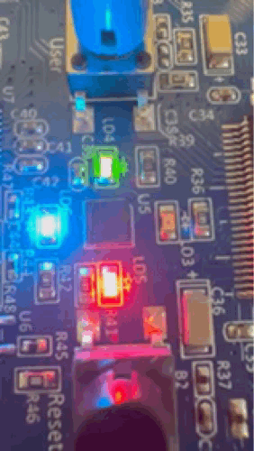
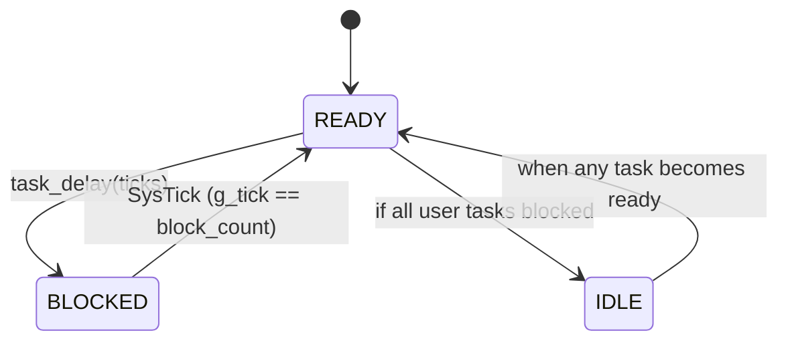

# Multi-LED Cooperative Scheduler (STM32F4)



> Short clip: LEDs blinking at different frequencies. SysTick unblocks, PendSV switches.

A minimal, educational **bare-metal cooperative** scheduler for ARM Cortex-M4 (STM32F407G-DISC1) that blinks multiple LEDs at independent periods using **SysTick** for timing and **PendSV** for context switching. This is **not an RTOS**; it focuses on TCBs, per-task PSP stacks, and a READY/BLOCKED/IDLE state machine.

---

## ✨ Features
- Cooperative scheduling with READY/BLOCKED task states
- Per-task stacks using **PSP**; exceptions use **MSP**
- Context switch via **PendSV** (save R4–R11; restore next task; update PSP)
- **SysTick @ 1 kHz** as the time base and unblocking engine
- Direct register access (no HAL) to keep mechanics transparent
- Small, well-commented code ideal for learning and blog posts

---

## 📁 Repo Layout
```
.
├── src/
│   ├── main.c      // scheduler + handlers + tasks
│   ├── main.h      // config, memory map, core regs, macros
│   ├── led.c       // minimal GPIO driver (PD12..PD15)
│   └── led.h
├── docs/
│   ├── demo.gif       // short clip for README
│   └── timeline.png   // timeline figure (simpler two-task example)
├── LICENSE
└── README.md
```

---

## 🧠 How it works

### Per-task state machine


### Switching path (tick to switch)

```mermaid
flowchart LR
  S["SysTick (1 kHz)"] -->|g_tick++| U["unblock_tasks()"]
  U -->|pend PendSV| P["ICSR.PENDSVSET=1"]
  P --> H["PendSV_Handler"]
  H -->|save R4..R11| Save[Save context]
  Save -->|save_psp_value| Pick["update_current_task"]
  Pick -->|get_psp_value| Get["get_psp_value"]
  Get -->|restore R4..R11 + set PSP| Run["Resume next task"]
```


### Timeline (two-task illustration)


> The figure shows Green (1000 ms) and Orange (500 ms) tasks toggling LEDs and blocking, with Idle filling the gaps. Red dashed markers indicate SysTick/PendSV moments.

---

## 🔢 Task rates (ticks @ 1 kHz)
| LED (GPIOD pin) | Period (ms) |
|---|---:|
| Green (PD12)  | 1000 |
| Orange (PD13) |  500 |
| Blue (PD15)   |  250 |
| Red (PD14)    |  125 |

---

## 🛠️ Build & Flash

### Option A — STM32CubeIDE (easiest)
1. Create a new project for **STM32F407VGTX**.
2. Drop the `src/` files into your `Src/` and `Inc/` (or add `src/` to include paths).
3. Ensure your linker script matches the board (e.g., `STM32F407VGTX_FLASH.ld`).
4. Build & Debug with **ST-LINK**.

---

## 🧪 Troubleshooting
- **No LED activity**  
  Check GPIOD clock enable and MODER bits; verify PD12–PD15 mapping.
- **PendSV not firing**  
  Confirm `ICSR.PENDSVSET` writes; ensure PendSV priority is lowest and SysTick runs.

---

## ❓ FAQ
**Is this an RTOS?** No — it’s a tiny, **bare-metal cooperative scheduler**. To grow toward an RTOS, add priorities and ready queues, IPC (semaphores/queues), timers, and task create/delete.

**Do I need to clear PENDSV?** No — hardware clears the pending state on exception entry; manual clears can drop legitimate requests.

---

## 📜 License

MIT. See `LICENSE`.

---

## 🙌 References
- [ARM Cortex M4 User Guide](https://developer.arm.com/documentation/dui0553/latest/)
- [STM32F407 Reference Manual](https://www.st.com/resource/en/reference_manual/dm00031020-stm32f405-415-stm32f407-417-stm32f427-437-and-stm32f429-439-advanced-arm-based-32-bit-mcus-stmicroelectronics.pdf)
- [Fast Bit Embedded Brain Academy](https://www.udemy.com/user/kiran-nayak-2/): Embedded Systems Programming on ARM Cortex-M3/M4 Processor
- [Making Embedded Systems: Design Patterns for Great Software](https://books.google.com/books/about/Making_Embedded_Systems.html?id=fLP4EAAAQBAJ&source=kp_book_description) by Elecia White


